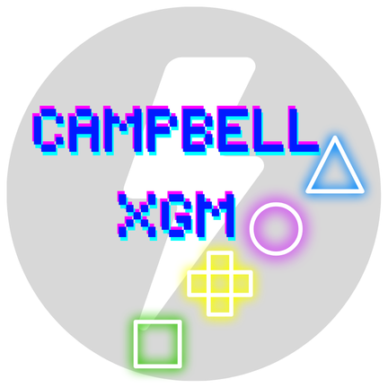

<div align="center">
  
  <h1>CampbellXGM FlowOS</h1>
  <p><strong>Extreme Gaming Mode App for Android</strong></p>
  <p>Locks pings, freezes background apps, and maximizes device performance.</p>

  <h3><a href="https://github.com/niiabe/campbellxgm-flowos/raw/master/downloads/CampbellXGMFlowOS-v1.3.0.apk">📥 Download CampbellXGMFlowOS-v1.3.0.apk</a></h3>
</div>

---

## Overview

**CampbellXGM** is a high-performance, native Android app built to turn your device into an uninterrupted gaming console. Designed with a sleek, high-contrast **Pure Black, Neon Red, and Electric Blue** Alienware-style aesthetic, the app acts as a master control switch for your Android environment. 

When you launch a game through CampbellXGM, it aggressively shuts down system distractions to ensure zero dropped frames, locked pings, and peak hardware performance.

## Key Features

*   **Aggressive App Freezing:** Kills ALL background apps using three methods — Device Owner suspension, Accessibility force-stop, or background process killing. Finds every running process (not just launcher apps) and periodically re-kills them every 5 seconds.
*   **Auto-Teardown:** Detects when you leave a game via Usage Access monitoring and automatically restores all system settings — no manual "Stop Game Mode" tap needed.
*   **Auto-Start Game Mode:** Add your games to the dashboard, enable auto-start, and game mode activates automatically when you launch any saved game.
*   **FPS Overlay:** Shows real-time frame rate on screen during gameplay.
*   **Thermal Cooldown Protection:** Monitors battery temperature. If your device overheats, it throttles CPU to prevent hardware damage, then restores performance when safe.
*   **Network Boost & Custom DNS:** Disables background sync, binds to active network, and overrides DNS to fast private endpoints (Cloudflare, Google, AdGuard, Quad9).
*   **DND & Notification Filter:** Silences all notifications or allows only calls and priority messages during gameplay.
*   **Keep Screen Awake & Auto-Brightness Lock:** Prevents screen timeout and locks brightness for consistent gaming.
*   **Storage Cleaner:** Clears game cache and temp files before launch to free storage.
*   **Ping Stabilizer VPN:** Keeps mobile radio active with periodic keepalive packets to prevent connection drops.
*   **CPU/GPU Tuner:** Sets CPU governor to maximum performance mode (requires Device Owner).
*   **Battery Profile:** Disables battery saver and optimizes power for gaming.

## Settings Dashboard

The app features a fully categorized control center with 13 toggles:

- **System Privileges:** Device Admin, Device Owner (ADB), Accessibility Service, Usage Access
- **Performance:** Aggressive App Freezing, CPU/GPU Tuner, Battery Profile, Cool-down Mode, Storage Cleaner
- **Connectivity:** Network Boost, Ping Stabilizer, DNS Provider
- **Game Mode:** DND, Notification Filter, Auto-Start Game Mode, FPS Overlay, Keep Screen Awake, Auto-Brightness Lock

## Pro Features (Roadmap)

- **Individual Game Profiles:** Per-game engine configurations
- **Real-Time Hardware HUD:** Floating widget with live RAM, CPU, and Battery stats
- **Custom Crosshair Overlay:** Customizable aiming reticle for FPS games
- **Macro Recorder:** Record and replay touch sequences

## Tech Stack

*   **Language:** Kotlin
*   **UI:** Jetpack Compose + Compose Navigation
*   **Concurrency:** Kotlin Coroutines & StateFlow
*   **System APIs:** DeviceAdminReceiver, AccessibilityService, VpnService, UsageStatsManager, NotificationManager

## Setup & Installation

> **Warning:** CampbellXGM uses powerful system APIs. You must grant specialized permissions for full functionality.

1. Build the APK: `./gradlew assembleDebug`
2. Install the APK to your device
3. Open the app — you'll be guided through the permission flow:
   - **Device Admin** — for aggressive app freezing
   - **Do Not Disturb** — to silence notifications during gameplay
   - **Notifications** — for the "Stop Game Mode" persistent notification
   - **Modify System Settings** — for Keep Screen Awake and Auto-Brightness Lock
   - **Accessibility Service** — for force-stopping background apps
   - **Usage Access** — for auto-teardown and auto-start game mode
4. *(Optional)* For maximum power, grant Device Owner via ADB:
   ```bash
   adb shell dpm set-device-owner com.campbell.xgm/.domain.services.CampbellAdminReceiver
   ```
5. Add games to the Dashboard, tap **Launch**, and game mode activates!

## Changelog

See [CHANGELOG.md](CHANGELOG.md) for the full version history.
